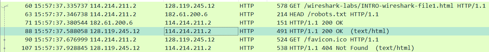
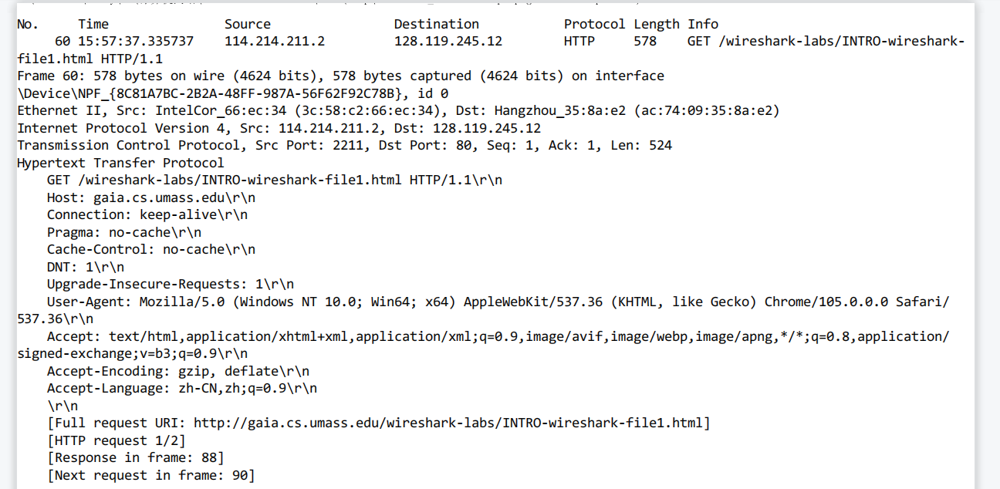
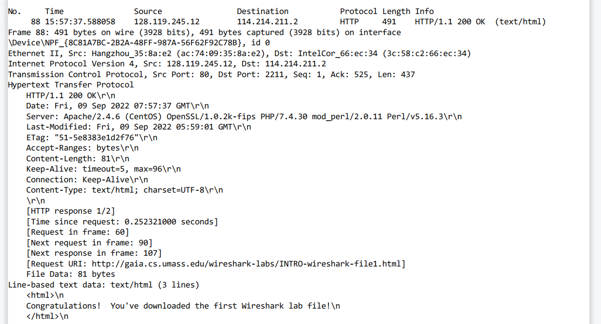

# Wireshark_Intro_v7.0

## 1. List 3 different protocols that appear in the protocol column in the unfiltered packet-listing window in step 7 above. 

- TCP 
- ARP
- UDP

## 2. How long did it take from when the HTTP GET message was sent until the HTTP OK reply was received? (By default, the value of the Time column in the packet-listing window is the amount of time, in seconds, since Wireshark tracing began. To display the Time field in time-of-day format, select the Wireshark *View* pull down menu, then select Time *Display Format*, then select *Time-of-day*.)

$37.588058-37.335737=0.252321s$

## 3. What is the Internet address of the gaia.cs.umass.edu (also known as wwwnet.cs.umass.edu)? What is the Internet address of your computer?

我的电脑：114.214.211.2

gaia.cs.umass.edu ：128.119.245.12

## 4. Print the two HTTP messages (GET and OK) referred to in question 2 above. To do so, select *Print* from the Wireshark *File* command menu, and select the“*Selected Packet Only”* and *“Print as displayed”* radial buttons, and then click OK.

