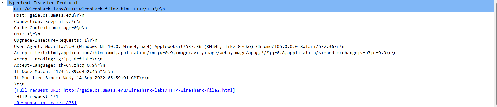

# Wireshark_HTTP_v7.0

## 1. Is your browser running HTTP version 1.0 or 1.1? What version of HTTP is the server running?

在GET和OK消息 从如图位置可以看到

浏览器和服务器都运行HTTP version 1.1

## 2. What languages (if any) does your browser indicate that it can accept to the server?

在GET消息 从如图位置可以看到

可以接受的语言是zh-CN，zh

## 3. What is the IP address of your computer? Of the gaia.cs.umass.edu server?

在GET消息 从如图位置可以看到

我的电脑ip地址为 114.214.229.132

gaia.cs.umass.edu 服务器的ip地址为 128.119.245.12

## 4. What is the status code returned from the server to your browser?

在OK消息 从如图位置可以看到

status code 为 200

## 5. When was the HTML file that you are retrieving last modified at the server?

在OK消息 从如图位置可以看到

上次修改时间为 Wed, 14 Sep 2022 05:59:01 GMT

## 6. How many bytes of content are being returned to your browser?

在OK消息 从如图位置可以看到

128 bytes 的文件被返回

## 7. By inspecting the raw data in the packet content window, do you see any headers within the data that are not displayed in the packet-listing window? If so, name one.

在OK消息 从如图位置可以看到

以下首部行在包列表中没有显示

Last-Modified: Wed, 14 Sep 2022 05:59:01 GMT\r\n

Accept-Ranges: bytes\r\n

## 8. Inspect the contents of the first HTTP GET request from your browser to the server. Do you see an “IF-MODIFIED-SINCE” line in the HTTP GET?

第一次的GET消息中没有 IF-MODIFIED-SINCE

## 9. Inspect the contents of the server response. Did the server explicitly return the contents of the file? How can you tell?

从下图中可以看到服务器显式返回了文件内容

## 10. Now inspect the contents of the second HTTP GET request from your browser to the server. Do you see an “IF-MODIFIED-SINCE:” line in the HTTP GET? If so, what information follows the “IF-MODIFIED-SINCE:” header?

在第二次的GET消息中看到了IF-MODIFIED-SINCE，在它的后面是一个时间，这个时间与第一次OK消息中的Last-Modified 后面的信息相同

## 11. What is the HTTP status code and phrase returned from the server in response to this second HTTP GET? Did the server explicitly return the contents of the file? Explain.

第二次OK消息的status code 是304，phrase 为 Not Modified，这次服务器没有显式返回文件内容，因为文件内容在上次请求后没有改变，可以使用缓存的之前请求内容

## 12. How many HTTP GET request messages did your browser send? Which packet number in the trace contains the GET message for the Bill or Rights?

如下图所示，浏览器发送了一个GET request，在173号packet中含有对Bill or Rights的GET message

## 13. Which packet number in the trace contains the status code and phrase associated with the response to the HTTP GET request?

在第一个TCP段中含有与HTTP GET request 的 response 相关的 status code 和phrase

## 14. What is the status code and phrase in the response?

如13题中图所示，为200 OK

## 15. How many data-containing TCP segments were needed to carry the single HTTP response and the text of the Bill of Rights?

如12题中图所示，需要4个

## 16. How many HTTP GET request messages did your browser send? To which Internet addresses were these GET requests sent?

如下图所示，浏览器发送了三个HTTP GET request

如下所示，三个GET request的地址分别如下

128.119.245.12（http://gaia.cs.umass.edu/wireshark-labs/HTTP-wireshark-file4.html）

128.119.245.12（http://gaia.cs.umass.edu/pearson.png）

178.79.137.164（http://kurose.cslash.net/8E_cover_small.jpg）

因为封面图片发生了https重定向，因此状态码为301，在配置了sllkey后，可以解析出HTTPS重定向后对应的封面图片的GET和OK package，如下所示

## 17. Can you tell whether your browser downloaded the two images serially, or whether they were downloaded from the two web sites in parallel? Explain.

根据图中所示，在浏览器连续发出两个图片的Get request后，服务器返回Response，因此图片是并行下载的

## 18. What is the server’s response (status code and phrase) in response to the initial HTTP GET message from your browser?

第一次HTTP GET message 的回应 OK消息中的status code and phrase为 401 Unauthorized

## 19. When your browser’s sends the HTTP GET message for the second time, what new field is included in the HTTP GET message?

如下所示，第二次HTTP GET message比起第一次，包含了Cache-Control和Authorization

