# Wireshark_DNS_v7.0

## 1. Run *nslookup* to obtain the IP address of a Web server in Asia. What is the IP address of that server?

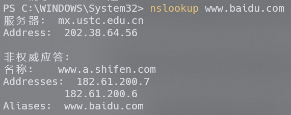

Web server www.baidu.com 的IP地址为182.61.200.7和182.61.200.6

## 2. Run nslookup to determine the authoritative DNS servers for a university in Europe.

因国内无法查询欧洲大学，以南京大学作为替代，得到两个结果 dns.nju.edu.cn ns.nju.edu.cn

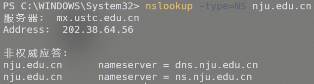

## 3. Run nslookup so that one of the DNS servers obtained in Question 2 is queried for the mail servers for Yahoo! mail. What is its IP address?

在第二题中获得的两个服务器无法查询雅虎的邮件服务器，故换用ns.ustc.edu.cn

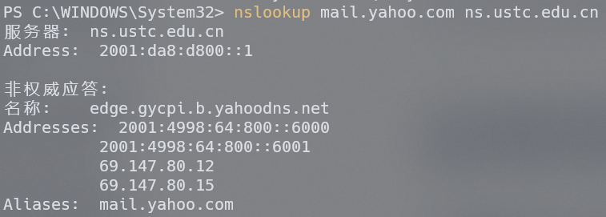

得到的IP地址（ipv4）为69.147.80.12和69.147.80.15

## 4. Locate the DNS query and response messages. Are then sent over UDP or TCP?

它们使用UDP协议

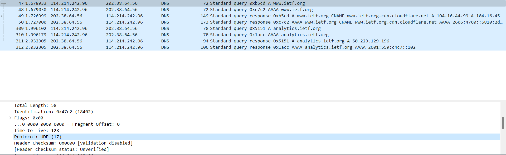

## 5. What is the destination port for the DNS query message? What is the source port of DNS response message?

如图所示，DNS query message的目标端口是53

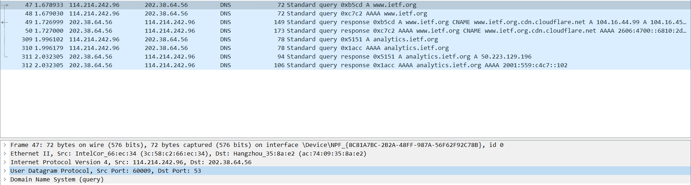

如图所示，DNS response message的源端口是53

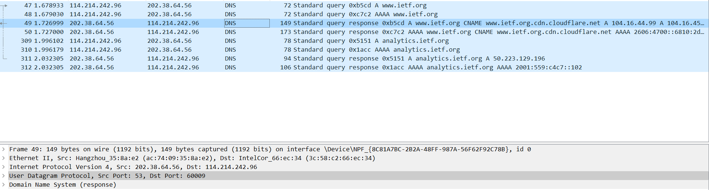

## 6. To what IP address is the DNS query message sent? Use ipconfig to determine the IP address of your local DNS server. Are these two IP addresses the same?

如图所示，DNS query message发送的目标IP地址为202.38.64.56，这与ipconfig中查询到的本地DNS服务器相同

## 7. Examine the DNS query message. What “Type” of DNS query is it? Does the query message contain any “answers”?

如图所示，DNS query的类型为A和AAAA，分别请求主机的ipv4和ipv6地址

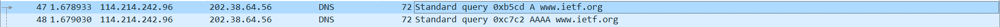

query message不包含任何answer

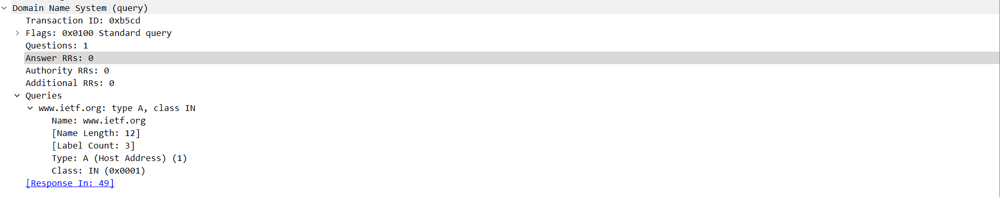

## 8. Examine the DNS response message. How many “answers” are provided? What do each of these answers contain?

类型为A的request 收到的response包含三条 answer，包含一条类型为CNAME的dns记录和两条类型为A的dns记录，其中记录了请求的主机名对应的规范主机名和主机名对应的两条ip地址(ipv4)

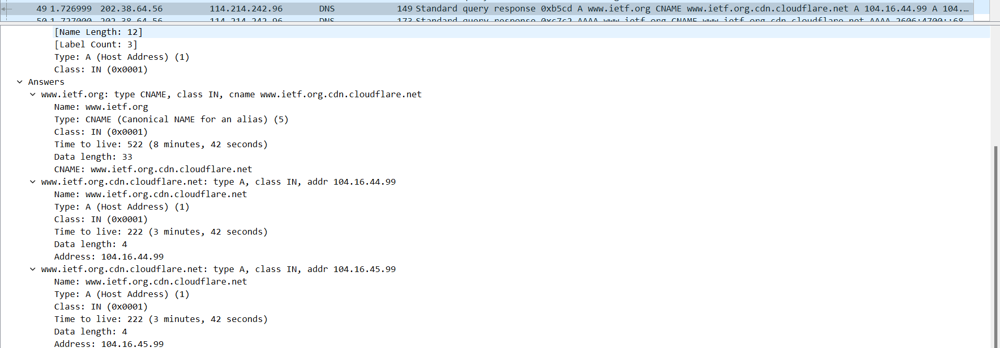

类型为AAAA的request 收到的response包含三条 answer，包含一条类型为CNAME的dns记录和两条类型为A的dns记录，其中记录了请求的主机名对应的规范主机名和主机名对应的两条ip地址(ipv6)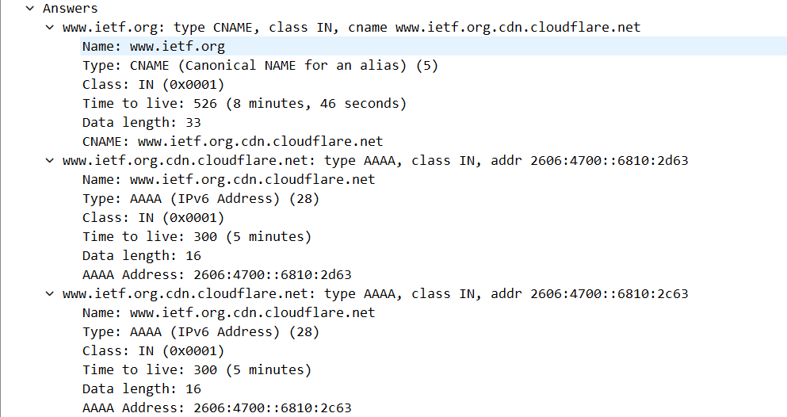

## 9. Consider the subsequent TCP SYN packet sent by your host. Does the destination IP address of the SYN packet correspond to any of the IP addresses provided in the DNS response message?

如图所示，在后续我的主机发送的TCP SYN packet中含有目的IP地址与DNS response message中提供IP相同的package

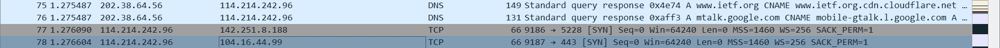

## 10. This web page contains images. Before retrieving each image, does your host issue new DNS queries?

不会发送新的DNS query

## 11. What is the destination port for the DNS query message? What is the source port of DNS response message?

如图所示，DNS query message的destination port与DNS response message的source port均为53

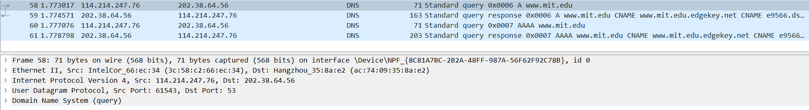

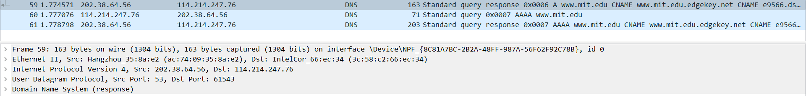

## 12. To what IP address is the DNS query message sent? Is this the IP address of your default local DNS server?

如图所示，DNS query message发送的目标IP地址为202.38.64.56，这与默认本地DNS服务器相同

## 13. Examine the DNS query message. What “Type” of DNS query is it? Does the query message contain any “answers”?

DNS query message的类型分别为A和AAAA，分别查询目标主机的ipv4和ipv6地址，query message不包含任何answer

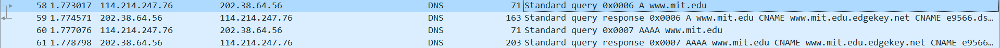

## 14. Examine the DNS response message. How many “answers” are provided? What do each of these answers contain?

类型为A的requset 收到的response包含三条 answer，包含两条类型为CNAME的dns记录和一条类型为A的dns记录，其中记录了请求的主机名对应的两个规范主机名和主机名对应的ip地址(ipv4)

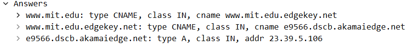

类型为AAAA的requset 收到的response包含四条 answer，包含两条类型为CNAME的dns记录和两条类型为AAAA的dns记录，其中记录了请求的主机名对应的两个规范主机名和主机名对应的两个ip地址(ipv6)

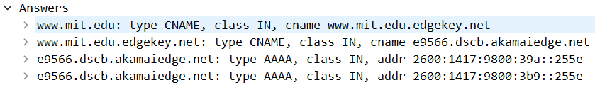

## 15. Provide a screenshot.

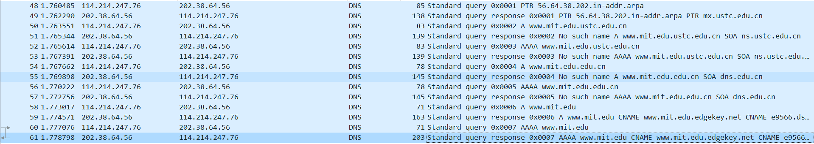

## 因执行nslookup –type=NS mit.edu本地dns服务器超时，故将mit.edu换为nju.edu.cn，完成16-19题

## 16. To what IP address is the DNS query message sent? Is this the IP address of your default local DNS server?

如图所示，DNS query message发送的目标IP地址为202.38.64.56，这与默认本地DNS服务器相同

## 17. Examine the DNS query message. What “Type” of DNS query is it? Does the query message contain any “answers”?

DNS query message的类型为NS，query message不包含任何answer

## 18. Examine the DNS response message. What MIT nameservers does the response message provide? Does this response message also provide the IP addresses of the MIT namesers?

在response message中得到了两个nameserver，分别为ns.nju.edu.cn和dns.nju.edu.cn，没有提供它们的ip地址

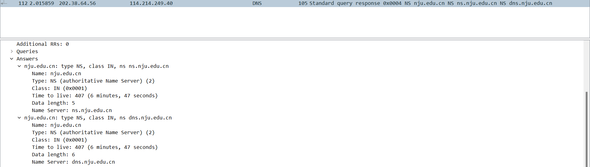

## 19. Provide a screenshot.

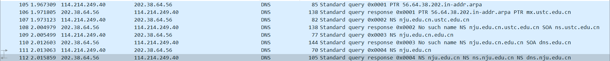

## 因执行nslookup www.aiit.or.kr bitsy.mit.edu超时，故执行 nslookup www.aiit.or.kr  dns.google，完成20-23题

## 20. To what IP address is the DNS query message sent? Is this the IP address of your default local DNS server? If not, what does the IP address correspond to?

如图所示，DNS query message发送的目标IP地址为2001:4860:4860::8844，这与默认本地DNS服务器不同，这是指定的dns.google服务器的地址

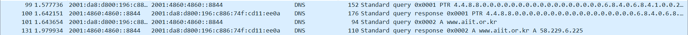

## 21. Examine the DNS query message. What “Type” of DNS query is it? Does the query message contain any “answers”?

DNS query message的类型为A，query message不包含任何answer

## 22. Examine the DNS response message. How many “answers” are provided? What does each of these answers contain?

收到的response包含一条answer，为A类型，是主机www.aiit.or.kr对应的ip地址

## 23. Provide a screenshot.

