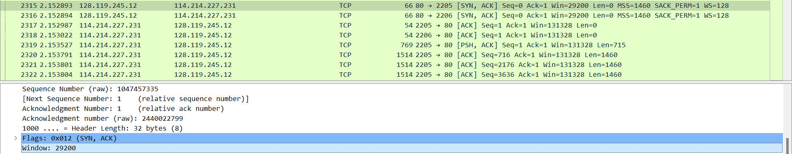

# Wireshark_TCP_v7.0

## 1. What is the IP address and TCP port number used by the client computer (source) that is transferring the file to gaia.cs.umass.edu? To answer this question, it’s probably easiest to select an HTTP message and explore the details of the TCP packet used to carry this HTTP message, using the “details of the selected packet header window” (refer to Figure 2 in the “Getting Started with Wireshark” Lab if you’re uncertain about the Wireshark windows.

在下载的tcp-ethereal-trace-1中找到带有http信息的tcp包，可以看到client computer的ip地址为192.168.1.102，tcp端口号为1161

## 2.What is the IP address of gaia.cs.umass.edu? On what port number is it sending and receiving TCP segments for this connection?

从第一题的图中可以看到，gaia.cs.umass.edu的ip地址为128.119.245.12，在此次连接中收发tcp段的端口号为80

## 3. What is the IP address and TCP port number used by your client computer (source) to transfer the file to gaia.cs.umass.edu? 

在我的电脑上捕获的tcp包中可以看到，client computer的ip地址为114.214.227.231，tcp端口号为2205

## 4. What is the sequence number of the TCP SYN segment that is used to initiate the TCP connection between the client computer and gaia.cs.umass.edu? What is it in the segment that identifies the segment as a SYN segment?

tcp syn的序列号是0，在段中是flags含有的一个标志位标明这个段是syn段

## 5. What is the sequence number of the SYNACK segment sent by gaia.cs.umass.edu to the client computer in reply to the SYN? What is the value of the Acknowledgement field in the SYNACK segment? How did gaia.cs.umass.edu determine that value? What is it in the segment that identifies the segment as a SYNACK segment?

SYNACK的序列号是0，Acknowledgement field的值为1，gaia.cs.umass.edu根据上次收到的tcp segment的序列号加1得到，在段中是flags含有的两个标志位一起标明这个段是synack段

## 6. What is the sequence number of the TCP segment containing the HTTP POST command? Note that in order to find the POST command, you’ll need to dig into the packet content field at the bottom of the Wireshark window, looking for a segment with a “POST” within its DATA field.

包含http post指令的tcp段的序列号为1

## 7. Consider the TCP segment containing the HTTP POST as the first segment in the TCP connection. What are the sequence numbers of the first six segments in the TCP connection (including the segment containing the HTTP POST)? At what time was each segment sent? When was the ACK for each segment received? Given the difference between when each TCP segment was sent, and when its acknowledgement was received, what is the RTT value for each of the six segments? What is the EstimatedRTT value (see Section 3.5.3, page 242 in text) after the receipt of each ACK? Assume that the value of the EstimatedRTT is equal to the measured RTT for the first segment, and then is computed using the EstimatedRTT equation on page 242 for all subsequent segments.*Note:* Wireshark has a nice feature that allows you to plot the RTT for each of the TCP segments sent. Select a TCP segment in the “listing of captured packets” window that is being sent from the client to the gaia.cs.umass.edu server. Then select: *Statistics->TCP Stream Graph-*Round Trip Time Graph.

六个tcp段的序列号分别为 1 716 2176 3636 5096 6556

发送时间分别为 2.153527 2.153791 2.153801 2.153804 2.153807 2.153810

接收到ack的时间分别为 2.402862 2.402863 2.402863 2.402863 2.402863 2.402863

RTT值分别为 0.249335 0.249072 0.249062 0.249059 0.249056 0.249053

根据后五次RTT值依次更新EstimatedRTT得到的值分别为 0.249302 0.249272 0.249245 0.249221 0.249200

## 8. What is the length of each of the first six TCP segments?

在上一题的图中可以看到，长度分别为 715 1460 1460 1460 1460 1460

## 9. What is the minimum amount of available buffer space advertised at the received for the entire trace? Does the lack of receiver buffer space ever throttle the sender?

可用缓存空间的最小值为29200，在整个捕获中缓存空间一直较大，没有限制发送方

## 10. Are there any retransmitted segments in the trace file? What did you check for (in the trace) in order to answer this question?

没有发生重传，检查发送的tcp段的序列号是否重复可以验证是否重传

## 11. How much data does the receiver typically acknowledge in an ACK? Can you identify cases where the receiver is ACKing every other received segment (see Table 3.2 on page 250 in the text).

在一个ack中通常每次确认的数据量为1460，在确认量大于1460时，为表中第二种情况(延迟确认)，例如在2761号tcp段和2762号tcp段间ack的差值为2920

## 12. What is the throughput (bytes transferred per unit time) for the TCP connection? Explain how you calculated this value.

从图中可知发送的总字节数为153036，用总字节数除以发送用时（约1.3s），即可得到吞吐量为117720bytes/s

也可以利用Wireshark得到吞吐量

## 13. Use the *Time-Sequence-Graph(Stevens*) plotting tool to view the sequence number versus time plot of segments being sent from the client to the gaia.cs.umass.edu server. Can you identify where TCP’s slowstart phase begins and ends, and where congestion avoidance takes over? Comment on ways in which the measured data differs from the idealized behavior of TCP that we’ve studied in the text.

如下所示为时间序列图

tcp的慢启动阶段如下所示，在此之后就是拥塞控制接管

在测量数据中，慢启动阶段不是理想的指数增长

## 14. Answer each of two questions above for the trace that you have gathered when you transferred a file from your computer to gaia.cs.umass.edu

如下所示为时间序列图

tcp的慢启动阶段大约在前0.5s，在此之后就是拥塞控制接管

在测量数据中，慢启动阶段不是理想的指数增长