# Wireshark_IP_v7.0

## 1. Select the first ICMP Echo Request message sent by your computer, and expand the Internet Protocol part of the packet in the packet details window.What is the IP address of your computer?

如图所示，我的电脑的ip地址为114.214.250.61

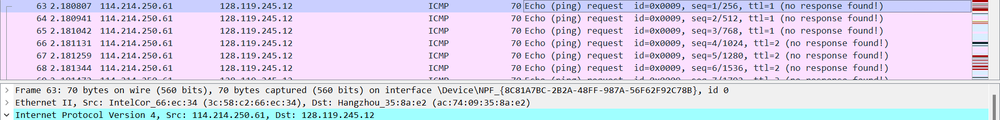

## 2. Within the IP packet header, what is the value in the upper layer protocol field?

如图所示，upper layer protocol field的值为ICMP（1）

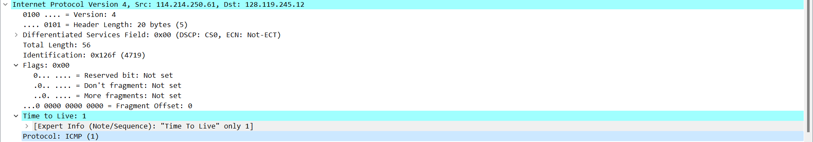

## 3. How many bytes are in the IP header? How many bytes are in the payload of the IP datagram? Explain how you determined the number of payload bytes.

如上图所示，Header Length 为 20 bytes，Total Length 为 56 bytes，则payload 为 56 - 20 = 36 bytes

## 4. Has this IP datagram been fragmented? Explain how you determined whether or not the datagram has been fragmented.

如第二题图所示，IP数据报没有被分割，从Flags段和Fragment Offset的值可以知道，并且Total Length 与设定的值相同

## 5. Which fields in the IP datagram always change from one datagram to the next within this series of ICMP messages sent by your computer?

从下面的截图可以看到，两个IP 数据报之间，Identification 、 Time to Live 、Header Checksum总是在变化 

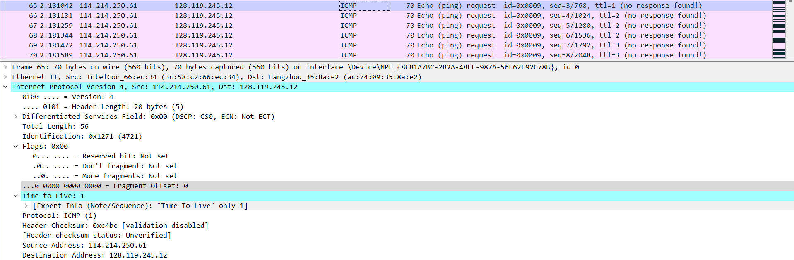

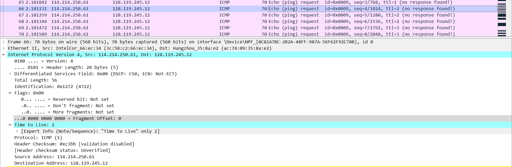

## 6. Which fields stay constant? Which of the fields must stay constant? Which fields must change? Why?

从上面的两个截图可以看到，Version 、 Header Length 、 Total Length 、 Flags 、 Fragment Offset 、 Protocol 、 Source Address 、 Destination Address保持不变，Total Length、Flags 、Fragment Offset 可能会变，因为实验中有56、2000、3500三种长度可能会发生分段 ，其他域在一次 traceroute 中 一定会保持不变的，因为在一次 traceroute中使用的配置是相同的

Identification 、 Time to Live 、Header Checksum 一定会改变，不同的数据报总是有着不同的 标识和检查和，同时在traceroute中会不断增大Time to Live 

## 7. Describe the pattern you see in the values in the Identification field of the IP datagram

从第五题的图中可以发现 Identification的值每次递增1

## 8. What is the value in the Identification field and the TTL field?

如图所示，Identification的值为5885，TTL的值为255

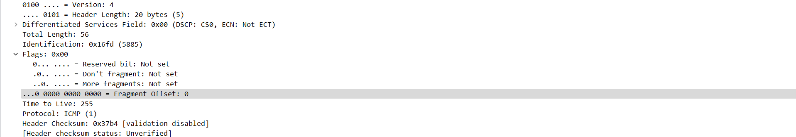

## 9. Do these values remain unchanged for all of the ICMP TTL-exceeded replies sent to your computer by the nearest (first hop) router? Why?

如图所示，Identification的值变化，TTL的值保持不变，因为Identification的值每个package都是不同的，而到达同一个服务器所需要的跳数相同，并且服务器配置相同，因此TTL值保持不变

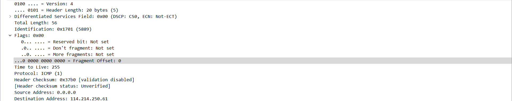

## 10. Find the first ICMP Echo Request message that was sent by your computer after you changed the Packet Size in pingplotter to be 2000. Has that message been fragmented across more than one IP datagram? [Note: if you find your packet has not been fragmented, you should download the zip file http://gaia.cs.umass.edu/wireshark-labs/wireshark-traces.zip and extract the ipethereal-trace-1packet trace. If your computer has an Ethernet interface, a packet size of 2000 should cause fragmentation.3

如图所示，ICMP Echo Request message被分成了两个 IP数据报

## 11. Print out the first fragment of the fragmented IP datagram. What information in the IP header indicates that the datagram been fragmented? What information in the IP header indicates whether this is the first fragment versus a latter fragment? How long is this IP datagram?

如图所示，Flags 域的 More fragments 为 Set 表明 数据报被分片，Fragment Offset 为 0表明它是第一个片段，Total Length 为 1500 表明这个IP数据报的长度为1500

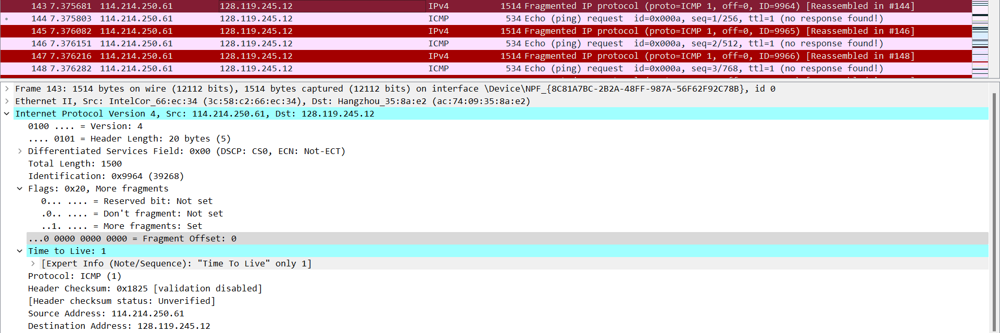

## 12. Print out the second fragment of the fragmented IP datagram. What information in the IP header indicates that this is not the first datagram fragment? Are the more fragments? How can you tell?

如图所示，Fragment Offset 为 1480 表明它不是第一个片段，Flags 域的 More fragments 为Not Set 表明没有更多的片段了

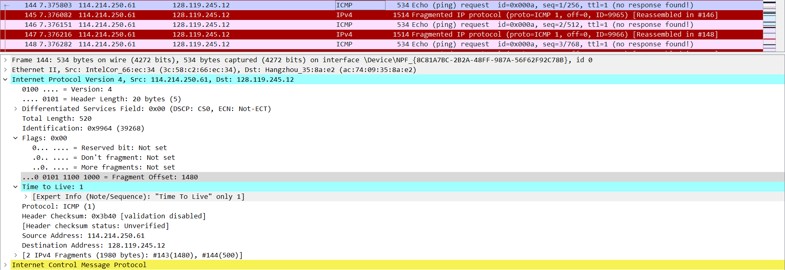

## 13. What fields change in the IP header between the first and second fragment?

从第11题和第12题的图中对比可以看到，Total Length 、More fragments 、 Fragment Offset 、 Header Checksum 不同 

## 14. How many fragments were created from the original datagram?

如图所示，每个数据报分成3段

## 15. What fields change in the IP header among the fragments?

如图所示，Total Length 、More fragments 、 Fragment Offset 、 Header Checksum 不同 

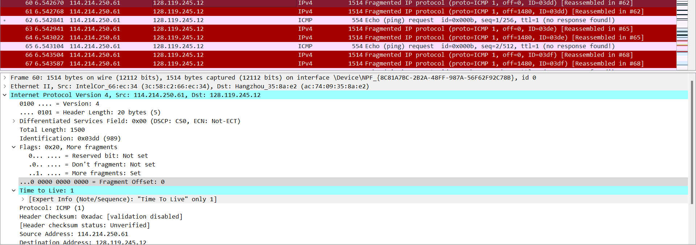

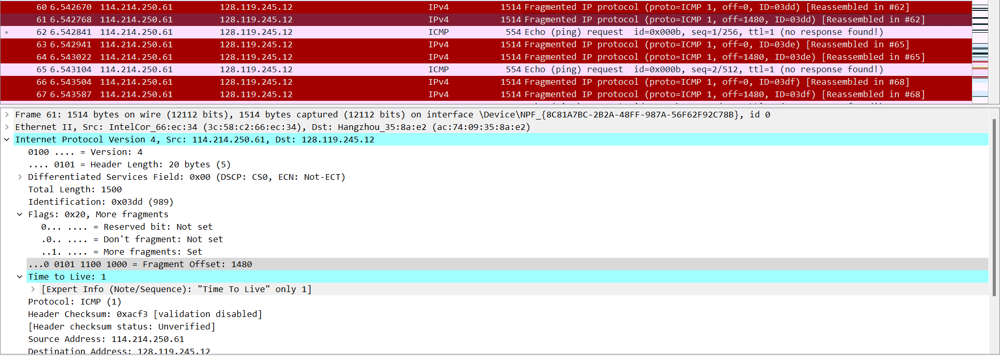

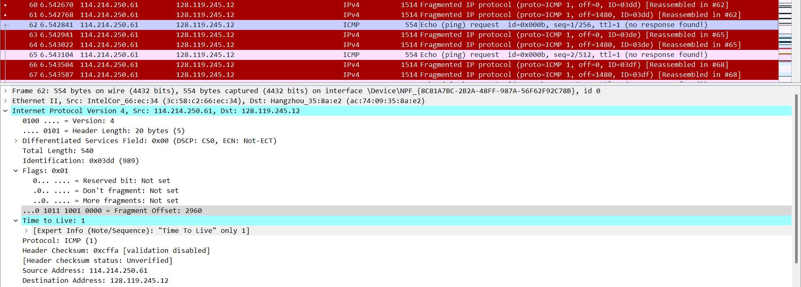